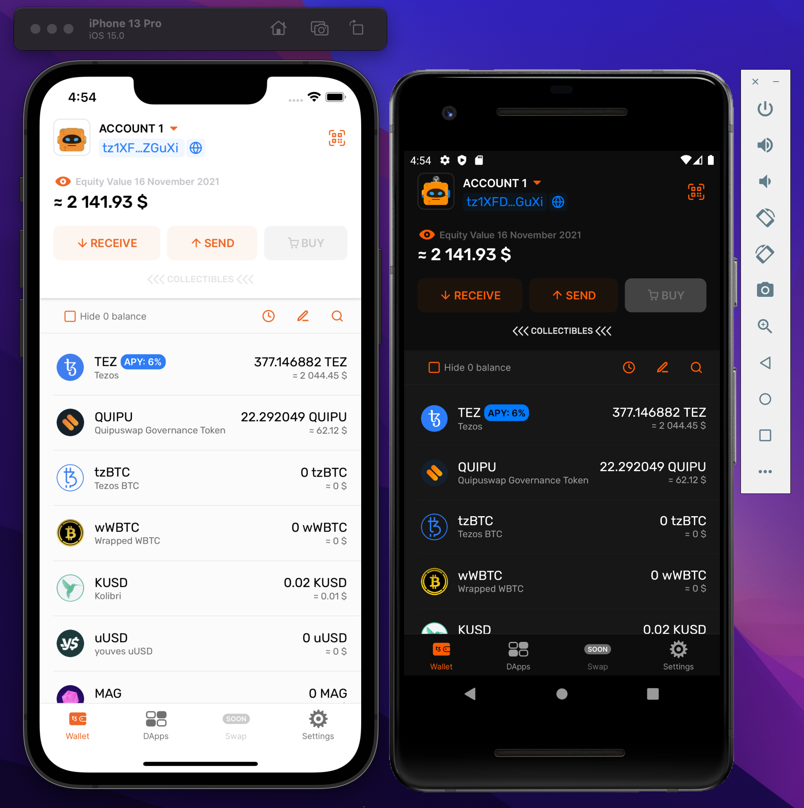

# 📝 About

Temple Wallet -  is a non-custodial crypto wallet for interacting with the Tezos ecosystem.

Temple provides the ability to interact with web-based decentralized applications (so-called "dApps") right from your mobile phone (iOS, Android).

Other important features include:
- Exploring various Tezos-based assets
- Multiple accounts
- Send/Receive FA1.2 / FA2  tokens
- Delegation to bakers
- Light/Dark mode switching



# ▶️ Installation

Follow these steps to build and run wallet locally.

## Setting up the development environment

1. Install [Node.js](https://nodejs.org)

2. Install yarn
```
sudo npm install --global yarn
```

3. Set up the [React Native development environment](https://reactnative.dev/docs/environment-setup).
3.1 Select **React Native CLI Quickstart**.
3.2 Select your **Development OS**.
3.3 Set up both **Target OS**


## Setting up the project

1. Clone repository
```
git clone https://github.com/madfish-solutions/templewallet-mobile.git && cd templewallet-mobile
```

2. Install dependencies
```
yarn
yarn ios:pods
```

3. Create `.env` file
```
cp .env.dist .env
```

## Running the application

To start the Android application run
```
yarn android
```

To start the iOS application run
```
yarn ios
```

If you want to contribute your code, before making a pull request - ensure, that code passes all pipeline checks. You can manually check it before a pull request running commands
```
yarn ts
yarn lint
yarn find-deadcode
yarn test
```
